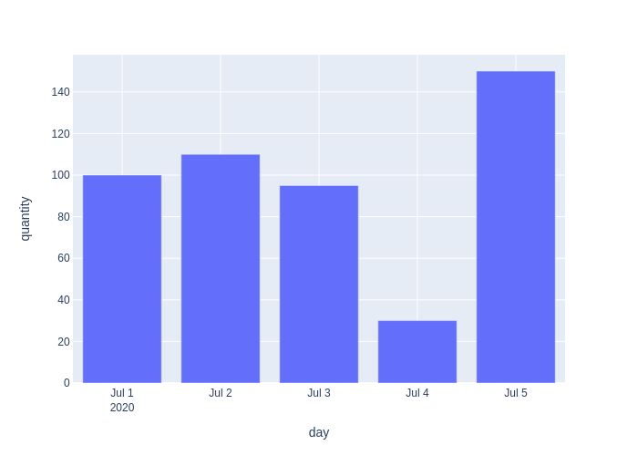
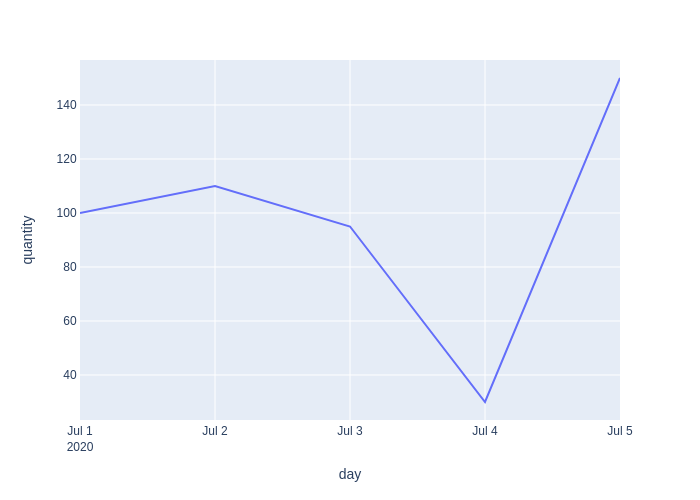
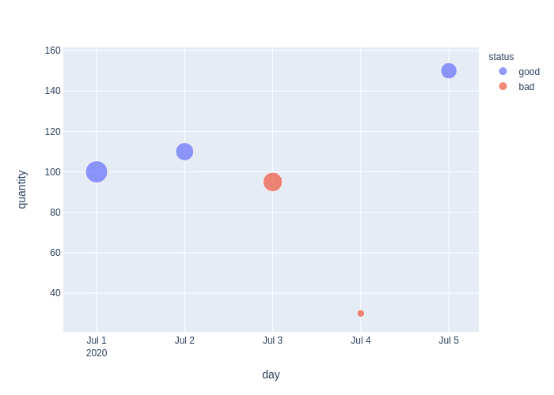

# Simple chart generator using FastAPI and Plotly Express

The idea of the project is to generate simple charts from an API request and save it to a png.


# Install and use

To install dependencies just run `pip install -r requirements.txt` and to run uvicorn `uvicorn src.main:app`, then you will see the docs in our `http://127.0.0.1:8000/docs`

## Charts examples

### Bar Graph
```
curl -X POST \
    http://localhost:8000/charts \
    -H 'Content-Type: application/json' \
    -d '{ "data": { "day": ["2020-07-01", "2020-07-02", "2020-07-03", "2020-07-04", "2020-07-05"], "quantity": [100, 110, 95, 30, 150] }, "chart": "bar", "x": "day", "y": "quantity", "image_name": "bar_graph"}'
```



### Line Graph
```
curl -X POST \
    http://localhost:8000/charts \
    -H 'Content-Type: application/json' \
    -d '{ "data": { "day": ["2020-07-01", "2020-07-02", "2020-07-03", "2020-07-04", "2020-07-05"], "quantity": [100, 110, 95, 30, 150] }, "chart": "line", "x": "day", "y": "quantity", "image_name": "line_graph"}'
```


### Scatter Graph

```
curl -X POST \
    http://localhost:8000/charts \
    -H 'Content-Type: application/json' \
    -d '{ "data": { "day": [ "2020-07-01", "2020-07-02", "2020-07-03", "2020-07-04", "2020-07-05" ], "quantity": [ 100, 110, 95, 30, 150 ], "status": [ "good", "good", "bad", "bad", "good" ], "revenue": [ 186, 123.56, 142, 21, 100 ] }, "chart": "scatter", "x": "day", "y": "quantity", "color": "status", "size": "revenue", "image_name": "scatter_graph" }'
```

